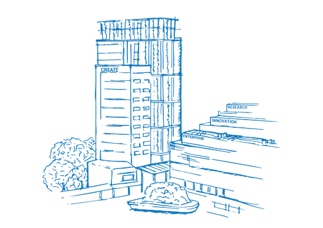

<!-- _class: title -->
<!-- _paginate: false -->
<!-- _header: '' -->
<!-- _footer: '' -->

# Agentic AI Workshop

<p class="lede">Week 2 &mdash; From LLMs to Agents: why language models work, and the ladder that turns one into an agent.</p>

<p class="byline">Dr. Kerem Delikoyun &nbsp;·&nbsp; TUMCREATE &nbsp;·&nbsp; 3 June 2026</p>



---

<!-- _class: opener -->

<p class="chapter">Block 0 · 5 min</p>

# Where we left off

<p class="blurb">Last week: how we got here, plus Claude Code and Organon &mdash; working agents, built as plain files on disk. Today we open the hood.</p>

---

## Week 1 recap, in one slide

<div class="two-col">

<div>

**What Week 1 covered**

- **Foundations** &mdash; two long paths (a 200-yr abstraction staircase + an 80-yr AI road) converge at natural language
- **Claude Code** &mdash; the CLI-native coding agent + its primitives: `CLAUDE.md`, tools, skills, sub-agents, MCP, hooks
- **Organon** &mdash; an agentic OS for scientists; memory, identity &amp; skills as files on disk
- The equation: **agent = LLM + primitives** (memory, identity, tools, learnings)

</div>

<div>

**Where Week 2 goes**

1. *Open the box* &mdash; why LLMs work at all
2. *Climb the ladder* &mdash; bare model &rarr; tools &rarr; reasoning
3. *Pick up a framework* &mdash; LangChain
4. *Give it memory* &mdash; RAG

</div>

</div>

<p class="muted small">Five Colab notebooks back every idea on the right. You'll run them as we go.</p>

---

<!-- _class: opener -->

<p class="chapter">Part 1 · Why LLMs work</p>

# Opening the box

<p class="blurb">Six slides on what a language model actually is &mdash; so "agent" isn't magic stacked on magic.</p>

---

## The unlock: one architecture, three exponentials

<div class="two-col">

<div>

For 60 years, language AI was hand-built rules and narrow models. Three things changed at once:

- **Architecture** &mdash; the Transformer (2017): attention replaces recurrence, so training parallelises across a whole sequence
- **Scale** &mdash; parameters from millions &rarr; hundreds of billions
- **Data + compute** &mdash; train on much of the public web

</div>

<div>

<div class="card">
<div class="label">The bitter lesson</div>

General methods that scale with compute beat clever hand-crafted ones. The Transformer was the first language architecture that kept getting better the more data and compute you fed it &mdash; no plateau in sight.

</div>

<p class="muted small">"Attention Is All You Need", Vaswani et al. 2017 &mdash; one of the five papers in today's RAG corpus.</p>

</div>

</div>

---

## One dumb objective: predict the next token

<div class="two-col-wide">

<div>

```
The capital of France is  ____
                          ↓
        P(next token)  →  " Paris"   0.91
                          " a"       0.02
                          " home"    0.01
                          ...
```

Train on trillions of tokens with a single self-supervised target: **guess the next token**. No labels, no human annotation &mdash; the text is its own answer key.

</div>

<div>

**Why this is enough.**

To predict the next token well across *all* of human text, the model is forced to learn grammar, facts, translation, arithmetic, code, and a little reasoning.

<div class="card">
<div class="label">Compression ≈ understanding</div>

Predicting well means modelling the structure that <em>generated</em> the text. Squeezing the web into weights forces useful abstractions to fall out.

</div>

</div>

</div>

---

## How text becomes math: tokens &rarr; embeddings

<div class="two-col">

<div>

**Tokenisation** &mdash; text is split into sub-word *tokens*.

```
"agentic"  →  ["agent", "ic"]
"RAG"      →  ["R", "AG"]
```

**Embedding** &mdash; each token maps to a vector in a high-dimensional space (hundreds&ndash;thousands of dims).

</div>

<div>

Meaning becomes *geometry*: tokens with similar meaning sit close together.

```
king  − man  + woman  ≈  queen
Paris − France + Japan ≈ Tokyo
```

<div class="card">
<div class="label">Why it matters today</div>

The <strong>same</strong> embedding idea powers RAG retrieval in Notebook 03 &mdash; we embed text chunks and find the nearest ones to a question.

</div>

</div>

</div>

---

## The engine: attention as learned relevance

<div class="two-col-wide">

<div>

```
   The  scientist  read  the  paper  because  it  was  ___

                                              │
                  ┌───────────────────────────┘
            "it" attends to → "paper"  (0.7)
                            → "scientist" (0.2)
```

Each token builds its meaning by **attending** to the other tokens that matter &mdash; weighting them by learned relevance. Stack this dozens of times and you get rich, context-aware representations.

</div>

<div>

**Two properties that changed everything:**

- **Parallel** &mdash; the whole sequence is processed at once (RNNs went word-by-word). This is what made web-scale training feasible.
- **Long-range** &mdash; a token can attend to anything in the context window, not just its neighbours.

<p class="muted small">A Transformer block = attention + a small feed-forward network, repeated N times.</p>

</div>

</div>

---

## Scaling laws &amp; emergence

<div class="two-col">

<div>

Performance improves *predictably* with model size, data, and compute &mdash; smooth power-law curves (Kaplan 2020; Hoffmann/**Chinchilla** 2022).

<div class="card">
<div class="label">Chinchilla, compute-optimal</div>

For a fixed compute budget, scale parameters and data <em>together</em> &mdash; about <strong>20 training tokens per parameter</strong>. Most early models were badly under-trained.

</div>

<p class="muted small">Chinchilla is paper #3 in today's RAG corpus &mdash; you'll retrieve this exact claim in Notebook 03.</p>

</div>

<div>

**Emergence** &mdash; some abilities are absent in small models and appear, fairly abruptly, past a scale threshold:

- in-context learning (learn from examples in the prompt, no weight update)
- multi-step arithmetic
- following instructions
- **chain-of-thought reasoning**

The capabilities we build on this week *emerged* from scale &mdash; nobody hand-coded them.

</div>

</div>

---

## Why this architecture fits us so well

<div class="two-col">

<div>

**Language is humanity's API.** We already encode knowledge, intent, and reasoning in text. A model fluent in text plugs straight into how we work &mdash; no new interface to learn.

**In-context learning ≈ working memory.** Put examples or facts in the prompt and behaviour adapts on the spot, like a person holding instructions in mind for one task.

</div>

<div>

<div class="card card-green">
<div class="label">System 1 vs System 2 (Kahneman)</div>

**System 1** &mdash; fast, automatic, intuitive. A raw next-token answer is System-1-like: one fluent pass, no deliberation.

**System 2** &mdash; slow, effortful, step-by-step. We *elicit* it by asking the model to reason out loud.

</div>

That single idea &mdash; **make the fast model slow down and deliberate** &mdash; is the seed of every reasoning pattern in Part 2.

</div>

</div>

<p class="muted small">Analogy, not a claim that models literally think. It's a useful map for <em>why</em> the patterns work.</p>

---

<!-- _class: opener -->

<p class="chapter">Part 2 · Single agents</p>

# The agentic ladder

<p class="blurb">From a bare model to a reasoning, tool-using agent &mdash; one rung at a time. All single-agent this week; multi-agent is Week 3.</p>

---

## The ladder &mdash; what we climb today

<div class="ladder">

```
  L3   Multi-agent systems        specialists + orchestration   →  Week 3
       ────────────────────────────────────────────────────────────────
  L2   + Reasoning                CoT · ToT · ReAct             ◀ today
  L1   + Tool use                 the model acts on the world   ◀ today
  L0   Bare LLM                   one prompt, one answer        ◀ today
```

</div>

<div class="two-col">

<div>

Each rung **adds one capability** to the rung below. Nothing here is a new model &mdash; it's the same LLM with more scaffolding around it.

</div>

<div>

<div class="card">
<div class="label">The thread</div>

L0 answers. L1 lets it <em>act</em>. L2 lets it <em>deliberate</em>. The "agent" is the loop you wrap around the model &mdash; not the model itself.

</div>

</div>

</div>

---

## Anatomy of an agent

```
                  ┌────────────────────┐
                  │   LLM (the brain)  │
                  └─────────┬──────────┘
                            │
   ┌────────────────────────┼────────────────────────┐
   │                        │                        │
┌──▼───┐               ┌────▼─────┐            ┌─────▼─────┐
│ Tools│               │  Memory  │            │  Control  │
│ APIs │               │ (context │            │   Loop    │
│ DBs  │               │  + RAG)  │            │ (you write│
│ Code │               └──────────┘            │  this!)   │
└──────┘                                       └───────────┘
```

**Tools** = capability. **Memory** = state. **Loop** = agency.
Take away the loop and you have an LLM call. Take away tools and you have a chatbot. Take away memory and you have amnesia.

---

## L0 — the bare LLM

<div class="two-col">

<div>

One prompt in, one answer out. Brilliant at language; blind beyond its training.

**What it cannot do:**

- Know anything after its training cut-off
- Look up a fact it didn't memorise
- Do anything in the world (send mail, query a DB, run code)
- Reliably do long exact arithmetic
- Tell you *why* it's confident

</div>

<div>

```
user ─▶ LLM ─▶ answer
```

<div class="card card-coral">
<div class="label">The ceiling</div>

A bare LLM is a brilliant <em>improviser</em> with no hands, no memory of today, and no scratchpad. Everything above this rung removes one of those limits.

</div>

</div>

</div>

---

## L1 — tool use: give the model hands

<div class="two-col-wide">

<div>

A **tool** is just a function the model may ask you to call. The loop:

```
  ┌──────────────────────────────────────┐
  │  1. LLM reads question + tool list   │
  │  2. LLM: "call calculator(17*25)"    │
  │  3. YOU run the function             │
  │  4. feed the result back            │
  │  5. loop until the LLM is done      │
  └──────────────────────────────────────┘
```

The model never runs anything. It *requests*; your code executes and returns the result.

</div>

<div>

**Function calling.** Modern models are fine-tuned to pick a tool and fill its arguments from a schema you provide.

<div class="card">
<div class="label">Who carries the responsibility?</div>

The <strong>vendor</strong> trained the tool-selection skill. <strong>You</strong> own writing clear tool names + descriptions. Get those right and the model routes well.

</div>

<p class="muted small">Suddenly the model can fetch fresh facts, query data, and act &mdash; L0's ceiling is gone.</p>

</div>

</div>

---

## L2 — reasoning: make the fast model slow down

The jump from L1 to L2 is **System 1 &rarr; System 2**. Same model, but we change the prompt so it *deliberates* before it answers or acts.

<div class="two-col">

<div>

<div class="card">
<div class="label">Chain-of-Thought</div>
Think in a straight line, out loud.
</div>

<div class="card">
<div class="label">Tree-of-Thoughts</div>
Branch, evaluate, search &mdash; don't bet on the first idea.
</div>

</div>

<div>

<div class="card card-green">
<div class="label">ReAct</div>
Reason <em>and</em> act &mdash; interleave thinking with tool calls.
</div>

<p class="muted small">CoT is the base. ToT searches over it. ReAct couples it to L1's tools. The next four slides take each in turn.</p>

</div>

</div>

---

## Chain-of-Thought (CoT)

<div class="two-col-wide">

<div>

Five words change the answer: **"Let's think step by step."**

```
Q: A juggler has 16 balls. Half are golf balls,
   and half of those are blue. How many blue
   golf balls?

DIRECT:           4        (right or wrong, no trace)

STEP BY STEP:
  16 balls → half golf      = 8 golf balls
  8 golf  → half blue       = 4 blue golf balls
  Answer: 4                  (visible, checkable)
```

</div>

<div>

The model uses its own intermediate tokens as a **scratchpad** &mdash; deliberate reasoning, summoned by a prompt.

<div class="card">
<div class="label">Why it works</div>

Hard problems need intermediate steps. Forcing the model to write them spends compute <em>before</em> the answer, instead of guessing in one pass.

</div>

<p class="muted small">CoT is System 2, on demand. It's the building block ReAct extends.</p>

</div>

</div>

---

## Tree-of-Thoughts (ToT)

<div class="two-col-wide">

<div>

CoT commits to one line of reasoning. If an early step is wrong, the whole chain is wrong. **ToT treats reasoning as search.**

```
                  problem
                  /  |  \
            branch  branch  branch     ← PROPOSE several thoughts
              │       │       │
            eval    eval    eval        ← EVALUATE: sure / maybe / dead
              │               ✗
            expand          prune
              │
            …continue the promising branches
```

</div>

<div>

**Propose &rarr; evaluate &rarr; expand the best**, with backtracking out of dead ends.

<div class="card">
<div class="label">The trade</div>

ToT spends a lot more compute (many model calls) to buy accuracy on problems where one CoT chain routinely fails &mdash; planning, puzzles, proof search.

</div>

<p class="muted small">Notebook 02 shows one propose/evaluate level live on the Game of 24.</p>

</div>

</div>

---

## ReAct = Reason + Act

<div class="two-col-wide">

<div>

CoT thinks. L1 acts. **ReAct interleaves them** in one loop (Yao et al. 2022): a Thought, an Action (tool call), the Observation it returns &mdash; repeat.

```
Answer the question. Tools: {tools}

Question: the input question
Thought:  reasoning about what to do next
Action:   one of [{tool_names}]
Action Input: the input to the action
Observation: the result of the action
... (repeat) ...
Thought:  I now know the final answer
Final Answer: ...
```

</div>

<div>

**There is no "ReAct API".** It's English in a fixed format that the model produces and *we* parse.

<div class="card">
<div class="label">The mechanism</div>

Stop the model right after "Action Input". Run the tool yourself. Append the real "Observation". Re-prompt. The model never hallucinates a result &mdash; it reads the one your code returned.

</div>

</div>

</div>

---

## What a ReAct trace looks like

<pre>
Thought: I need the authors of the ReAct paper first.
Action: web_search
Action Input: ReAct paper LLM reasoning acting authors
Observation: Yao et al., ICLR 2023 (arXiv:2210.03629).

Thought: Now the year of the transformer paper.
Action: web_search
Action Input: transformer paper Attention Is All You Need year
Observation: Published in 2017 (Vaswani et al.).

Thought: I have both. 2023 - 2017.
Action: calculator
Action Input: 2023 - 2017
Observation: 6

Thought: I now know the final answer.
Final Answer: ReAct (Yao et al., 2023) came six years after the
transformer paper (Vaswani et al., 2017).
</pre>

<p class="muted small">Thought &rarr; Action &rarr; Observation, repeat. That loop <em>is</em> the agent. You'll build it by hand in Notebook 02.</p>

---

## Two ways to pick a tool

<div class="two-col">

<div>

### ReAct agent
Tool choice lives in the **prompt** you write. The model emits `Action: / Action Input:` as text; you parse it with a regex.

- **High control** &mdash; read and edit every step
- Brittle parsing; works even on models with no native tool API

</div>

<div>

### Function-calling agent
Tool choice is the **model vendor's** native capability. It returns a structured tool call; no parsing.

- **Less control**, much less headache
- Robust; needs a modern tool-calling model

</div>

</div>

<div class="card">
<div class="label">"Where do we shift the responsibility?"</div>

ReAct keeps tool selection in <em>your</em> prompt; the function-calling agent shifts it to the <em>vendor</em>. Most production agents use function calling; ReAct remains the clearest way to <em>understand</em> what an agent is.

</div>

---

<!-- _class: opener -->

<p class="chapter">Part 3 · The framework</p>

# A short intro to LangChain

<p class="blurb">We've climbed the ladder by hand. LangChain is the standard toolkit that implements every rung &mdash; so you don't re-write the loop each time.</p>

---

## What LangChain is (and isn't)

<div class="two-col">

<div>

A thin, **vendor-neutral** layer over "call a model, give it a prompt, maybe tools, parse the output." The same code runs on Anthropic, OpenAI, Google.

**Five pieces, one operator:**

| Piece | Class |
|---|---|
| Model wrapper | `ChatAnthropic` |
| Messages | `SystemMessage` / `HumanMessage` |
| Prompt template | `ChatPromptTemplate` |
| Output parser | `StrOutputParser` |
| Tool | `@tool` |

</div>

<div>

**LCEL &mdash; the pipe.** Connect components with `|`, like a Unix pipe:

```python
chain = prompt | llm | parser
chain.invoke({"concept": "embeddings"})
```

<div class="card">
<div class="label">It isn't magic</div>

Everything we built by hand &mdash; the tool loop, the ReAct parse &mdash; LangChain wraps in one call. Because you built the primitive first, the abstraction is transparent.

</div>

</div>

</div>

---

## LangChain implements the ladder

| Rung | By hand (Parts 1&ndash;2) | In LangChain |
|---|---|---|
| **L0** bare model | `client.messages.create(...)` | `ChatAnthropic(...).invoke(...)` |
| **L1** tool use | your `for` loop + regex | `create_tool_calling_agent` + `AgentExecutor` |
| **L2** ReAct | your prompt + `parse_action` | `create_react_agent` + `AgentExecutor` |
| **Memory** (RAG) | manual chunk + embed + search | loaders + splitters + vector stores + retrievers |

<p class="muted small">We pin the classic LangChain 0.3.x line &mdash; the last with <code>AgentExecutor</code>. LangGraph (the newer agent runtime) is the Week 3 reveal.</p>

---

## Structured output: function calling, aimed at the answer

<div class="two-col-wide">

<div>

```python
from pydantic import BaseModel, Field
from typing import Literal

class ClaimCheck(BaseModel):
    verdict: Literal["true", "false", "uncertain"]
    confidence: Literal["low", "medium", "high"]
    reason: str = Field(description="<= 15 words")

checker = llm.with_structured_output(ClaimCheck)
result = checker.invoke("The transformer paper is from 2017. True?")

result.verdict      # -> "true"  — a typed object, not a string
```

</div>

<div>

Point a schema at the **answer** instead of a tool, and the model fills it in. You get back a **validated Python object** — no regex, no "please respond in JSON".

<div class="card">
<div class="label">Same machinery</div>

It's the exact function-calling mechanism from the tool-calling agent. Reach for it whenever an agent's output feeds the next pipeline step and must have predictable fields.

</div>

<p class="muted small">Run live in Notebook 01.</p>

</div>

</div>

---

## From demo to production

<div class="two-col">

<div>

<div class="card">
<div class="label">Real tools — Tavily</div>

Our notebooks mock `web_search` so they run offline. In production, drop in a hosted search built for agents — same tool interface, real results:

```python
search = TavilySearchResults(max_results=3)
agent  = create_react_agent(llm, [search], prompt)
```

<p class="muted small"><code>langchain_community.tools.tavily_search</code></p>

</div>

</div>

<div>

<div class="card card-green">
<div class="label">Observability — LangSmith</div>

Set two env vars and every agent run is traced step-by-step — each Thought, Action, tool latency, token count — with no code change:

```python
LANGCHAIN_TRACING_V2 = "true"
LANGCHAIN_API_KEY    = "ls-..."
```

You debug an agent by **watching the trace**, not guessing.

</div>

</div>

</div>

---

## Hands-on: three notebooks, back to back

<div class="two-col">

<div>

<div class="card">
<div class="label">Notebook 00 · LangChain in 15 min</div>
Model wrapper, messages, prompt templates, the LCEL pipe, first <code>@tool</code>.
</div>

<div class="card">
<div class="label">Notebook 01 · Tool use</div>
The smallest agent, three ways: hand-rolled &rarr; native tool-use &rarr; LangChain tool-calling agent.
</div>

</div>

<div>

<div class="card">
<div class="label">Notebook 02 · ReAct, CoT, ToT</div>
CoT &rarr; hand-built ReAct loop &rarr; <code>create_react_agent</code> &rarr; ToT &rarr; the function-calling-vs-ReAct contrast.
</div>

<p class="muted small">Same model. Same loop you just saw on slides. Now you watch it run, step by step.</p>

</div>

</div>

<p><span class="run">▶ Switch to Colab &mdash; Notebooks 00, 01, 02</span></p>

---

<!-- _class: opener -->

<p class="chapter">Part 4 · Memory</p>

# RAG end-to-end

<p class="blurb">Retrieval-Augmented Generation gives the agent memory it can cite. Two parts &mdash; both visible &mdash; compared three ways.</p>

---

## RAG in one diagram

```
  PDFs ─▶ text ─▶ chunks ─▶ embeddings ─▶ vector store
                                                │
                                                ▼
  question ─▶ embed ─▶ top-k chunks ─▶ prompt + chunks ─▶ LLM ─▶ answer
                                                                  │
                                                                  ▼
                                                          [chunk-id citations]
```

Two halves. **Retrieval** finds the relevant chunks (same embedding idea from Part 1). **Augmentation** stuffs them into the prompt. The model's job becomes "answer from this context, and cite it."

---

## Build it with LangChain pieces

<div class="two-col">

<div>

Each pipeline stage is one LangChain class:

| Stage | Class |
|---|---|
| Load PDFs | `PyPDFLoader` |
| Split | `RecursiveCharacterTextSplitter` |
| Embed | `HuggingFaceEmbeddings` |
| Store (dense) | `FAISS` · `Chroma` |
| Store (sparse) | `BM25Retriever` |
| Fuse | `EnsembleRetriever` |

</div>

<div>

**FAISS vs Chroma** &mdash; both local, both `.as_retriever()`:

<div class="card">
<div class="label">FAISS</div>
Fastest pure-vector index, lives in RAM. Great default.
</div>

<div class="card card-green">
<div class="label">Chroma</div>
A small persistent local DB &mdash; write once, reopen later, no re-embedding.
</div>

<p class="muted small">Same retriever interface &mdash; the rest of the pipeline doesn't care which you pick.</p>

</div>

</div>

---

## Three retrieval strategies

<div class="two-col">

<div>

**Dense (FAISS / Chroma)**
- Embed query + chunks, cosine similarity
- Great for paraphrase &amp; synonyms
- "What does X *mean*?"

**Sparse (BM25)**
- Classical keyword scoring, no embeddings
- Great for exact terms
- "What about *RLAIF*?"

</div>

<div>

**Hybrid (EnsembleRetriever)**
- Fuses both with Reciprocal Rank Fusion
- Catches paraphrase **and** exact-term
- Usually wins on section-level hit

<div class="card card-green">
<div class="label">Notebook 04 appendix</div>
The same recipe on real Elasticsearch with native RRF &mdash; production substrate, same idea.
</div>

</div>

</div>

---

## The dirty secret of RAG: chunking dominates

<div class="two-col">

<div>

**Fixed-window** &mdash; split every N chars
- Fast; breaks sentences mid-thought

**Recursive** &mdash; paragraph &rarr; sentence &rarr; word
- Respects boundaries; LangChain default
- Better for dense *and* sparse

**Semantic** &mdash; split on embedding-distance jumps
- Slowest, sometimes best for narrative; we mention, don't build

</div>

<div>

<div class="card">
<div class="label">Notebook 03 · chunk + overlap</div>

137 pages &rarr; **676 chunks** at 800 chars / 100 overlap.

Chunk size and overlap usually move retrieval quality <em>more</em> than the choice of embedding model. Sweep them on your own corpus.

</div>

For the workshop we use **recursive** &mdash; the cheapest win.

</div>

</div>

---

## Comparison: hit@5 on five questions

<div class="two-col">

<div>

**Test set** &mdash; 5 questions, each labelled with its ground-truth paper + section keywords. Two metrics:

- **paper-hit@5** &mdash; right *paper* in the top 5?
- **section-hit@5** &mdash; right *part* of it?

The first is easy; the second is honest.

</div>

<div>

**Notebook 03 run (5-paper corpus):**

| | paper-hit | section-hit |
|---|---|---|
| Dense | 5/5 | 5/5 |
| BM25 | 5/5 | 5/5 |
| Hybrid | 5/5 | **5/5** |

On a small, clean corpus all three nail it. On a big messy one, hybrid pulls ahead &mdash; it catches both query types.

</div>

</div>

---

## RAG vs raw LLM &mdash; same question

<div class="two-col">

<div>

<div class="card card-coral">
<div class="label">Raw LLM</div>

"The ReAct loop interleaves reasoning and action..."

<p class="small muted">No citation. Possibly wrong on specifics. Sounds confident either way.</p>

</div>

</div>

<div>

<div class="card card-green">
<div class="label">RAG</div>

"...interleaving reasoning, action and observation improves groundedness <strong>[react_yao_2022.pdf#540]</strong>."

<p class="small muted">Every claim points to a chunk you can re-read.</p>

</div>

</div>

</div>

**Citations are the killer feature** &mdash; not prompt-engineering magic, just retrieval plus telling the model to cite its source.

<p><span class="run">▶ Switch to Colab &mdash; Notebook 03 (run the comparison, then ask a grounded question)</span></p>

---

<!-- _class: opener -->

<p class="chapter">Part 5 · 10 min</p>

# What's next &mdash; Week 3

<p class="blurb">A single ReAct + RAG agent covers a lot. Specialisation is the honest reason to reach for more than one.</p>

---

## Limits of the single-agent pattern

| Limit | Symptom | Fix in W3 |
|---|---|---|
| Context overflow | Long reasoning traces exhaust the window | Hand subtasks to specialists |
| No specialisation | One prompt does everything, none of it well | Planner / Retriever / Writer split |
| Sequential bottleneck | Parallel-decomposable work runs serially | Graph orchestration |
| Hard to evaluate | Can't isolate which step failed | Per-node metrics |

<p class="muted small">These are the <strong>L3</strong> rung &mdash; multi-agent systems &mdash; that we deliberately left off the ladder today.</p>

---

## Today's retriever becomes a W3 tool node

```
                ┌──────────────────────────────────────────┐
   user query   │             LangGraph orchestrator       │
       │        │                                          │
       └──────▶ │  ┌─────────┐   ┌──────────┐   ┌─────────┐│
                │  │ Planner │──▶│Retriever │──▶│ Writer  ││
                │  └─────────┘   └──────────┘   └─────────┘│
                │                      ▲                   │
                │            hybrid_retriever()            │
                │            ↑ straight from Notebook 03   │
                └──────────────────────────────────────────┘
```

The retrieval *function* doesn't change &mdash; the orchestrator around it does. Same with your ReAct loop: it becomes a node in a graph.

---

## What to read before Week 3

- **LangGraph quickstart** &mdash; `langchain-ai/langgraph` repo
- **Anthropic's "Building effective agents"** &mdash; the workflows-vs-agents section
- **GPT-Researcher** &mdash; a production multi-agent deep-research pattern
- Your **Notebook 02 ReAct trace** &mdash; bring it back; we'll convert it to a graph

---

<!-- _class: opener -->

<p class="chapter">Wrap-up</p>

# Take it home

<p class="blurb">Five notebooks, one mental model: the loop is the agent.</p>

---

## What you take home

- **Notebook 00** &mdash; LangChain in 15 minutes
- **Notebook 01** &mdash; tool use, three ways (hand-rolled &rarr; native &rarr; tool-calling agent)
- **Notebook 02** &mdash; CoT, ReAct from scratch &amp; via `create_react_agent`, ToT, FC-vs-ReAct
- **Notebook 03** &mdash; full RAG with FAISS + Chroma + hybrid retrieval
- **Notebook 04** &mdash; optional Elasticsearch appendix

All open in Colab from **github.com/krmdel/agentic-ai-for-scientists-workshop/week-02-patterns**

---

## One sentence to remember

<div class="card card-green">
<div class="label">The Week 2 takeaway</div>

A language model predicts the next token. An **agent** is the loop you wrap around it &mdash; tools give it hands, reasoning gives it a scratchpad, RAG gives it memory it can cite. Frameworks add ergonomics; they don't add the agency.

</div>

---

<!-- _class: title -->
<!-- _paginate: false -->
<!-- _header: '' -->
<!-- _footer: '' -->

# Questions?

<p class="lede">Kerem Delikoyun &nbsp;·&nbsp; TUMCREATE</p>
<p class="byline">kerem.delikoyun@tum-create.edu.sg &nbsp;·&nbsp; github.com/krmdel/agentic-ai-for-scientists-workshop</p>
